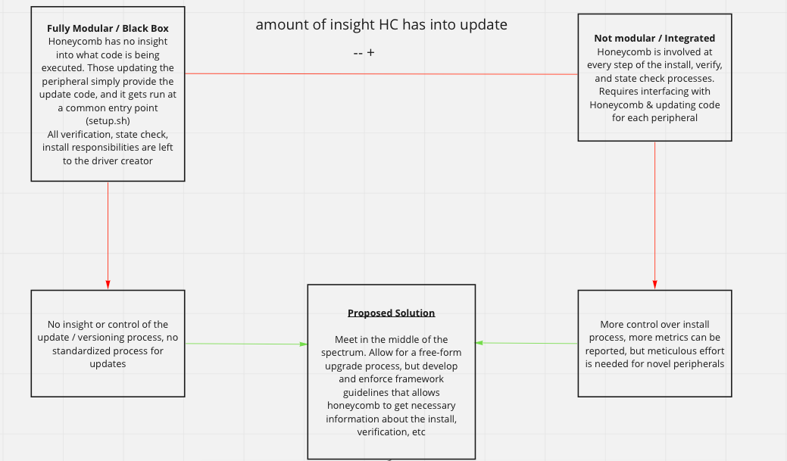
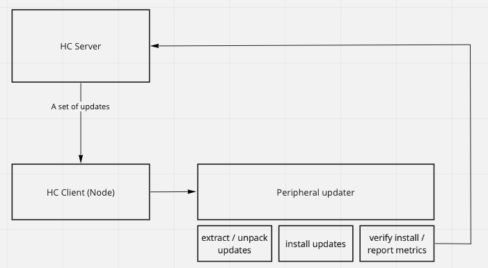

## Introduction

SAGE(Citation) is a grant dedicated to implementing edge computing functionality into the existing remote sensing Waggle(Citation) platform, which was also built on prior by the Array of Things(Citation) grant. The Waggle platform (and SAGE, as well) are all built on the principle of modularity. The waggle platform is set up for users of any purpose and utility to customize their remote-sensing node to their needs, including the types of peripherals and architecture of the nodes. An essential aspect of maintaining a fleet of nodes is acquiring information regarding the state of nodes, as well as having the ability to control them expressly.

Currently, functionality to monitor and control node states is relatively scarce, save for the diagnostic ability of the Waggle Sanity Test suite, which runs a series of tests to ensure nodes are in working order. The Waggle platform also offers a service called Beekeeper, which maintains and distributes a set of manifests that decide node functionality. 

When looking from a top-down perspective on the Waggle architecture, it becomes apparent that there is a gap in accessibility when managing node states. As such, the groundwork for Honeycomb, a modular node state manager, has been established as my work for the Summer of 2021. The goal of Honeycomb is to allow users to manage the configuration of peripherals on their nodes in a modular fashion.
To gain a better sense of Honeycomb's utility, let us consider a common use case. Consider a fleet of N Wild Sage nodes that use configurable cameras. To change the configuration of a camera, namely the pan and zoom settings, an engineer must log into the node via reverse tunnel and use a script to update the configuration manually. The process of an individual update is relatively quick, but can take an enormous amount of time with a fleet of N nodes. In this case, a system that distributes and installs a camera configuration to a node would save fantastic amounts of time, while providing valuable organizational insight to the user.

## Honeycomb design

Honeycomb's architecture revolves around modularity, and the ability to gain insight into any running upgrades. While modularity is essential, diagnostic information regarding upgrades is equally essential. However, this poses a paradox. A fully modular upgrade to Honeycomb implies that the upgrade code can simply be run from start to finish, with Honeycomb having no insight into the process, as any restrictions on the contents of the upgrade take away from its' modularity. On the other end of the spectrum, an upgrade that Honeycomb has great insight into would have to be nearly custom-written to work on the Honeycomb platform, and is not modular at all. 
As such, Honeycomb's architechture lies in the middle of the modularity spectrum. All upgrades written and queued must have a set of scripts that run a state check, install the upgrade, and verify installation. Honeycomb collects insight from these specific scripts, but the user is free to execute whatever code they please. In turn, Honeycomb can report metrics and insight to the user. 

### Honeycomb design specifics

Honeycomb exists in two major halves: A server-side UI and a client-side `systemd` service. 

As of early August 2021, the majority of the work for the Honeycomb client-side has been completed. Honeycomb's client-side runs as a `systemd` service, which runs a local `python3` `flask` server. Running a local `http` server on the host node allows for far greater flexibility when the specifics of the Honeycomb server-side counterpart will be designed in the future. Having an endpoint on the client-side server with open ports is unfeasible, as opening ports for non-vital activities on SAGE nodes is highly insecure. However, when the service to intercept upgrade payloads and requests is selected and implemented, the only tool required to use these upgrades is a simple local `http` request to the Honeycomb client. 

### Honeycomb basic flow
To make use of Honeycomb, one needs a properly-formatted Honeycomb payload, which can be built using a script provided in the Honeycomb repository. Next, the upgrade needs to be placed in the `./upgrades`, and an `http` request sent to `/queue-upgrade` with a `filename` query arg pointing to the upgrade file location. Next, the upgrade file is extracted to a temporary directory, and a series of checks to determine the upgrade validity are run. Should all checks pass, an instance of a `job` is created, which is handled in a separate thread by a singular `hc_manager` object. Any job put into the queue is sequentially removed and executed.
 
### Anatomy of a Honeycomb Upgrade
Honeycomb upgrades consist of three parts: 
* A state check, to ensure the state of the upgrade peripheral is correct. Mostly used to determine if an upgrade is necessary(Ex. A camera is on firmware V1.2, when the upgrade is for V1.1 -> V1.2). Ran through the script `hc_state_check.sh`
* An install script. Ran through `hc_install_upgrade.sh`, any and all install code should be executable through this script. 
* An install verification script, ran through `hc_verify_upgrade.sh`. Similar to the state check, but verifies that the upgrade script ran smoothly. 

The aforementioned scripts are executed sequentially, and require the success of the previous script to proceed. Any failure within a job is reported, and terminates. 

### Honeycomb OS versioning system

# Write about sanity check background 
## Write about sanity check work 

# Write about fault tolerance background (import maybe?)
