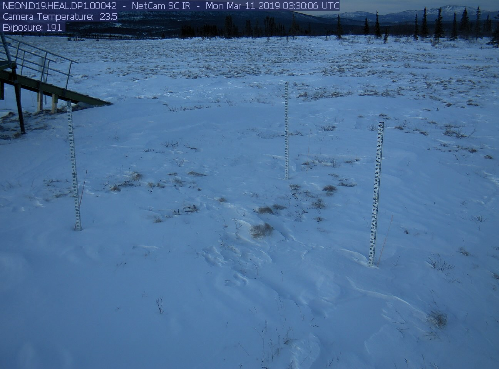
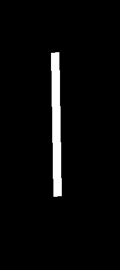
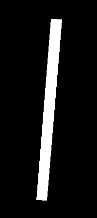

<!-- ## Heading 2
### Heading 3
#### Heading 4
##### Heading 5
###### Heading 6 -->

## Automatic Generation of Labeled Images

This program generates labels for images from [NEON.D19.HEAL.DP1.00042](https://phenocam.sr.unh.edu/webcam/browse/NEON.D19.HEAL.DP1.00042/). A 1296 x 960 image is inputted and 200 x 450 labeled images are outputted. Due to issues with the leftmost rod and the structure behind it, only the middle and rightmost rods of each images are labeled.

### How to Run

    run main.py

Be sure to add/change directories inside main.py.

 

Example Input: NEON.D19.HEAL.DP1.00042_2019_03_10_183006

Example Output(s): NEON.D19.HEAL.DP1.00042_2019_03_10_183006
Mid and Right

 

Below is the flow chart for labeling rods. (1) Color is extracted to group the images by similar color pixels. Based on the color pixels, the algorithm directs the images to certain image processing steps. (2) The image either gets processed by Otsu thresholding or Canny thresholding. (3) The longest contour is detected. If the longest contour is detected and it fits the criteria, then a mask will be output. If no contour is detected, the image proceeds to the next image processing technique, K-means clustering. (4) Following K-means clustering process, then it will undergo condour detection, again. If the contour is detected and fits criteria, then a mask will be outputted. If not, the algorithm exits. 

Here is a more detailed flowchart for each of the three image segmentation methods. A series of image processing techniques were used to improve robustness and coverage over a variety of images. 

