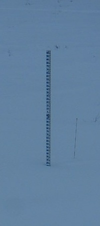
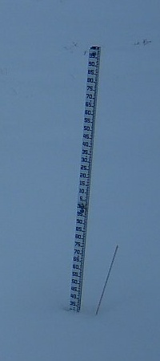
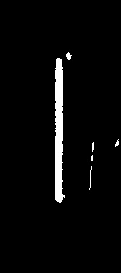
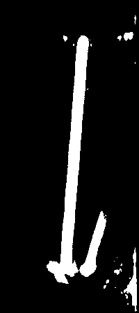

## U-Net Training

The testing algorithm uses models from checkpoint folder to make snow rod segmentations. The input is a 200 x 450 unprocessed image and the output is a 200 x 450 predicted binary image. 

### How to Run

Run on command line

    run new_main.py --model=[CHECKPOINT DIRECTORY, USE ONE MODEL] --image=[IMAGE DIRECTORY]

### Example Input:

Unprocessed Images:
 

 

Predicted Images:

 

 