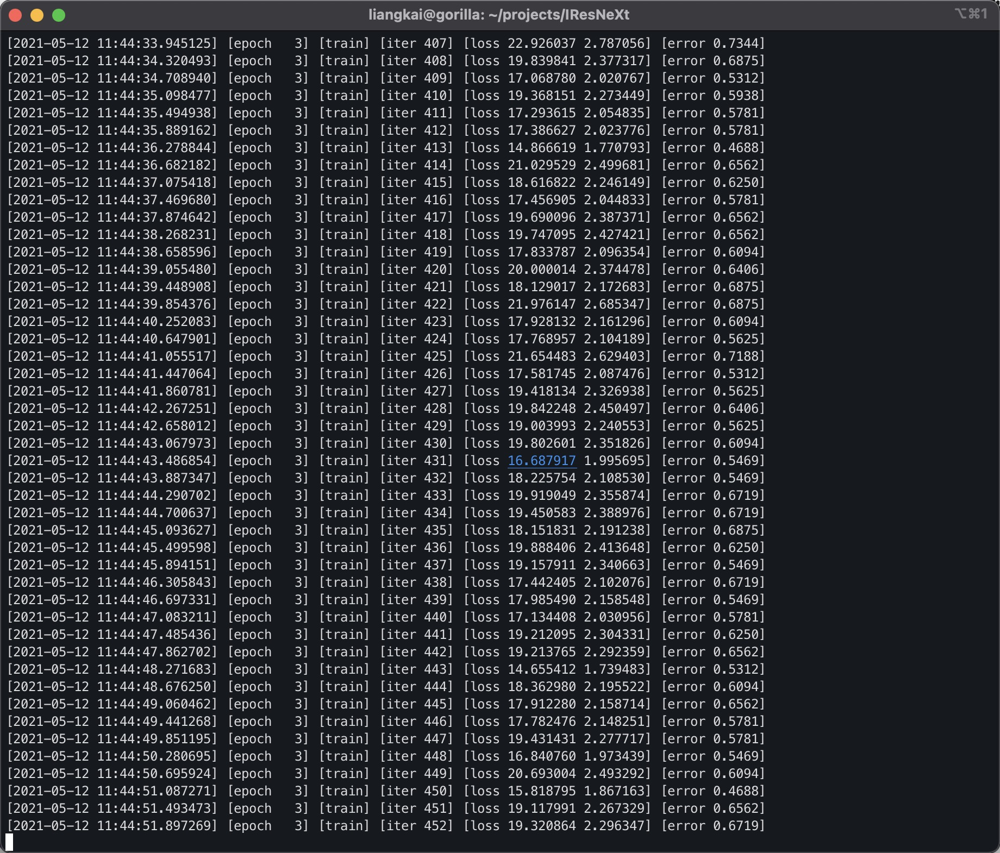
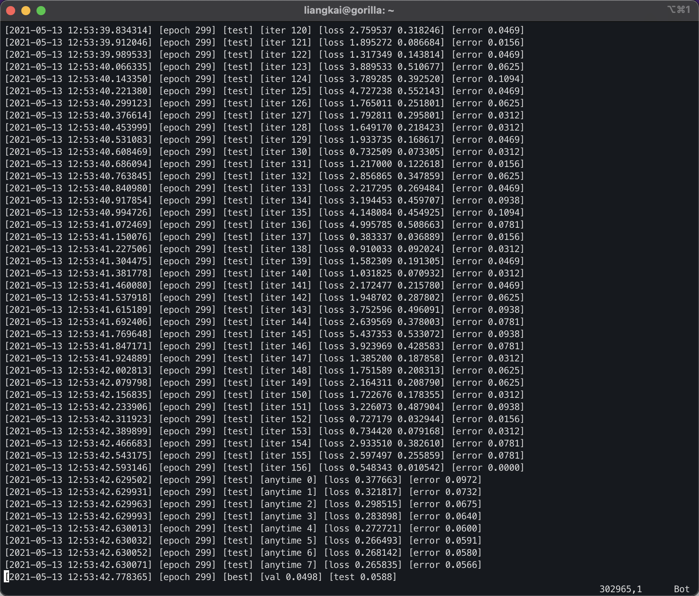
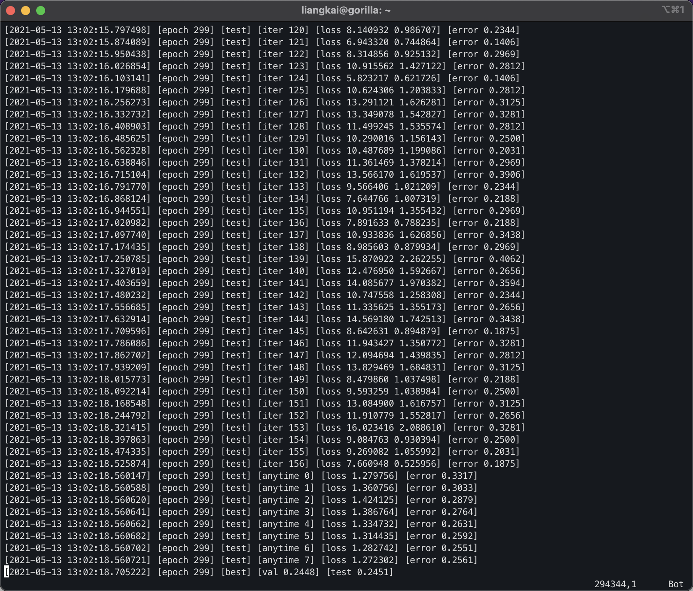

# Daily Notes - Liangkai Liu

## Week 1 (May 10 to May 14)

### May 10, 2021
#### Work Done:
 - I-20 CPT paperwork modification
 - Remote I-9 E-verify
 - Background check
 - Walk through Pytorch tutorials

### May 11, 2021
#### Work Done:
 - Set up account access to LCRC and JLSE 
 - Pytorch tutorial
 - Read papers on anytime DNN
 - Training anytime NN provided from "Anytime Neural Prediction via Slicing Networks Vertically" 

Github: https://github.com/hankook/IResNeXt



### May 12, 2021
#### Work Done:
 - Read papers on anytime DNN ([Zilberstein-AAAI-1996](../Liu/paper-notes/Zilberstein-AAAI-1996.md), [Dietterich-MCS-2000](paper-notes/Dietterich-MCS-2000.md), and [Lee-Arxiv-2018](paper-notes/Lee-Arxiv-2018.md))
 - Get anytime NN models for CIFAR10 and CIFAR100 provided from "Anytime Neural Prediction via Slicing Networks Vertically" 

CIFAR10:             |  CIFAR100:
:-------------------------:|:-------------------------:
  |  

### May 13, 2021
#### Work Done:
 - Read papers on anytime DNN ([Dietterich-MCS-2000](paper-notes/Dietterich-MCS-2000.md), and [Lee-Arxiv-2018](paper-notes/Lee-Arxiv-2018.md))
 - Implement the code from BranchyNet (https://github.com/kunglab/branchynet) and Distributed DNN (https://github.com/kunglab/ddnn).

### May 14, 2021
#### Work Done:
 - Read papers on anytime DNN ([BranchNet-ICPP-2016](paper-notes/BranchNet-ICPP-2016.md), and [DistributedDNN-ICDCS-2017](paper-notes/DistributedDNN-ICDCS-2017.md))
 - Set up access to Chameleon cluster and implement BranchyNet (https://github.com/kunglab/branchynet)
   - The code is based on Python2 and several dependent libraries' version are old
   - Error when running the code:
```
(branchnet) cc@llk-test:~/branchynet$ ./get_results.sh
Please download data from https://drive.google.com/file/d/0Byyuc5LmNmJPWUc5dVdUSms3U1E/view?usp=sharing and put it at datasets/data/pcifar10/data.npz
mkdir: cannot create directory ‘_models’: File exists
mkdir: cannot create directory ‘_figs’: File exists
/home/cc/anaconda3/envs/branchnet/lib/python2.7/site-packages/chainer/cuda.py:90: UserWarning: cuDNN is not enabled.
Please reinstall chainer after you install cudnn
(see https://github.com/pfnet/chainer#installation).
  'cuDNN is not enabled.\n'
Traceback (most recent call last):
  File "experiment_lenet_mnist.py", line 43, in <module>
    num_epoch=TRAIN_NUM_EPOCHS)
  File "/home/cc/branchynet/branchynet/utils.py", line 246, in train
    losses,accuracies = branchyNet.train_main(x,t)
  File "/home/cc/branchynet/branchynet/net.py", line 383, in train_main
    return self.train_model(self.main,x,t)
  File "/home/cc/branchynet/branchynet/net.py", line 356, in train_model
    loss = self.main.train(x,t)
  File "/home/cc/branchynet/branchynet/links/links.py", line 130, in train
    h = self(x,False,starti,endi)
  File "/home/cc/branchynet/branchynet/links/links.py", line 124, in __call__
    h = link(h)
  File "/home/cc/anaconda3/envs/branchnet/lib/python2.7/site-packages/chainer/links/connection/convolution_2d.py", line 101, in __call__
    x, self.W, self.b, self.stride, self.pad, self.use_cudnn)
  File "/home/cc/anaconda3/envs/branchnet/lib/python2.7/site-packages/chainer/functions/connection/convolution_2d.py", line 318, in convolution_2d
    return func(x, W, b)
  File "/home/cc/anaconda3/envs/branchnet/lib/python2.7/site-packages/chainer/function.py", line 197, in __call__
    outputs = self.forward(in_data)
  File "/home/cc/anaconda3/envs/branchnet/lib/python2.7/site-packages/chainer/function.py", line 309, in forward
    return self.forward_gpu(inputs)
  File "/home/cc/anaconda3/envs/branchnet/lib/python2.7/site-packages/chainer/functions/connection/convolution_2d.py", line 133, in forward_gpu
    cover_all=self.cover_all)
  File "/home/cc/anaconda3/envs/branchnet/lib/python2.7/site-packages/chainer/utils/conv.py", line 73, in im2col_gpu
    h, w, out_h, out_w, kh, kw, sy, sx, ph, pw, dy, dx, col)
  File "cupy/core/elementwise.pxi", line 545, in cupy.core.core.ElementwiseKernel.__call__ (cupy/core/core.cpp:35812)
  File "cupy/util.pyx", line 35, in cupy.util.memoize.decorator.ret (cupy/util.cpp:1259)
  File "cupy/core/elementwise.pxi", line 405, in cupy.core.core._get_elementwise_kernel (cupy/core/core.cpp:34288)
  File "cupy/core/elementwise.pxi", line 12, in cupy.core.core._get_simple_elementwise_kernel (cupy/core/core.cpp:27667)
  File "cupy/core/elementwise.pxi", line 32, in cupy.core.core._get_simple_elementwise_kernel (cupy/core/core.cpp:27489)
  File "cupy/core/carray.pxi", line 87, in cupy.core.core.compile_with_cache (cupy/core/core.cpp:27176)
  File "/home/cc/anaconda3/envs/branchnet/lib/python2.7/site-packages/cupy/cuda/compiler.py", line 153, in compile_with_cache
    cubin = nvcc(source, options, arch)
  File "/home/cc/anaconda3/envs/branchnet/lib/python2.7/site-packages/cupy/cuda/compiler.py", line 78, in nvcc
    _run_nvcc(cmd, root_dir)
  File "/home/cc/anaconda3/envs/branchnet/lib/python2.7/site-packages/cupy/cuda/compiler.py", line 56, in _run_nvcc
    raise RuntimeError(msg)
RuntimeError: `nvcc` command returns non-zero exit status.
command: ['nvcc', '--cubin', '-arch', 'sm_75', '/tmp/tmp5tgPag/kern.cu']
return-code: 1
stdout/stderr:
/tmp/tmp5tgPag/kern.cu(14): error: identifier "__float2half_rn" is undefined

/tmp/tmp5tgPag/kern.cu(17): error: identifier "__float2half_rn" is undefined

/tmp/tmp5tgPag/kern.cu(20): error: identifier "__float2half_rn" is undefined

/tmp/tmp5tgPag/kern.cu(23): error: identifier "__float2half_rn" is undefined

/tmp/tmp5tgPag/kern.cu(26): error: identifier "__float2half_rn" is undefined

/tmp/tmp5tgPag/kern.cu(29): error: identifier "__float2half_rn" is undefined

/tmp/tmp5tgPag/kern.cu(32): error: identifier "__float2half_rn" is undefined

/tmp/tmp5tgPag/kern.cu(35): error: identifier "__half2float" is undefined

8 errors detected in the compilation of "/tmp/tmpxft_00004622_00000000-6_kern.cpp1.ii".
```

## Week 2 (May 17 to May 21)

### Monday May 17, 2021
#### Work Done:
 - Paperwork on Tax files
 - Walk through Pytorch tutorials
 - Read papers on anytime DNN ([BranchNet-ICPP-2016](paper-notes/BranchNet-ICPP-2016.md), and [DistributedDNN-ICDCS-2017](paper-notes/DistributedDNN-ICDCS-2017.md))
 - Work through the [Neural Networks and Deep Learning book's](http://neuralnetworksanddeeplearning.com/) chapter 2 and chapter 3
   - how stochastic gredient decent works
   - backpropogation's prove
   - Implementation codes using SGD and backpropogation

#### Questions and Thoughs for Anytime DNN:

 - Motivation of Anytime DNN: Compared with research activities in building more powerful hardware/accelerators and architectures to speed up the DNN’s inference time, anytime DNN seems to be less competitive. The usage of it seems to be limited to **resource-constraint scenarios** and there is **no penalty for performance degradation**.
 - Contradictions in building anytime DNN: According to Zilberstein’s paper (AAAI-1996), I think one of the core part of anytime algorithm is to set up the relationship between time/resources and results qualities, statistically or theoretically. On the other hand, as a black-box based approach, it is hard to explain how DNN learns, especially **the impact of intermediate results from sub layers**, which makes it hard to set up this kind of relationship between time/resources and results qualities for DNN. 
 - Decompose with applications and dataset: Customized designs for specific application and dataset to make it possible to be anytime is feasible. **The real challenge is to propose a general approach which decomposes with applications and datasets**.

### Tuesday May 18, 2021
#### Work Done:
 - Set up and understand the code and prove of SGD and backpropogation
 - Read the chapter 3 on methods to imporve the performance of Neural Networks; understand the function of cross-entropy and softmax with code
 - Try training BranchNet model on Chameleon cluster with different versions of CUDA and CUDNN to solve the error
 - Read papers on anytime DNN ([BranchNet-ICPP-2016](paper-notes/BranchNet-ICPP-2016.md), and [DistributedDNN-ICDCS-2017](paper-notes/DistributedDNN-ICDCS-2017.md)) 
 - Finish training IResNext on GPU cluster 
 - Meeting with Raj to discuss the overall plan and how to integrate the anytime DNN project into the PhD disertation

### Wednesday May 19, 2021
#### Work Done:
 - Read research papers on anytime DNN ([IResNext](paper-notes/Lee-Arxiv-2018.md),[BranchNet-ICPP-2016](paper-notes/BranchNet-ICPP-2016.md), and [DistributedDNN-ICDCS-2017](paper-notes/DistributedDNN-ICDCS-2017.md)) 
 - Contine to learn the chapter3 of machine learning book
   - The problem of slow learning for quadratic cost
   - The prove of cross-entropy's impact to solve the slow learning problem
   - The prove of using softmax function with log-likelihood cost to sovle the slow learning problem

### Thursday May 20, 2021
#### Work Done:
 - Finish the chapter3 of machine learning book
   - The problem of overfitting in DNN training, using regulariztion to overcome this problem
     - understand why regularization could reduce overfitting; the impact of using smaller weights than larger weights (weight decay)
     - L1 regularization: the weights shrink by a constant amount toward 0
     - L2 regularization: the weights shrink by an amount which is proportional to weights
   - Dropout: randomly (and temporarily) deleting half the hidden neurons in the network, while leaving the input and output neurons untouched
   - Artificially expanding the training data
     - MNIST: rotations, translating and skewing the images of the dataset
     - speech recognition: adding noisy
 - Learn weight initialization techniques
   - weights and bias: Gaussian random variabales with mean 0 and standard deviation 1
   - modified weights initialization
   - turns out to only accelerate the training process, not improve the model performance
 - How to choose a neural network’s hyper-parameters
 - Variations on stochastic gradient descent
   - Hessian techniques: incorporating information about second-order changes in the cost function
   - Momentum-based gradient descent: introduces a notion of “velocity”
 - Other models of artificial neuron:
   - sigmoid: stop learning when they saturate, i.e., when their output is near either 0 or 1
   - tanh: compute any function39 mapping inputs to the range −1 to 1; stop learning when they saturate 
   - ReLU: increasing the weighted input to a rectified linear unit will never cause it to saturate, and so there is no corresponding learning slowdown. On the other hand, when the weighted input to a rectified linear unit is negative, the gradient vanishes, and so the neuron stops learning entirely.

### Friday May 21, 2021
#### Work Done:
 - Have a meeting with Nicola and Sean to discuss the anytime project progress
   - update on the research papers and knowledges about DNN's training
   - open challenges for building anytime system for SAGE project
     - target applications
     - how to set up the relationship for anytime/anywhere's impact to performance
 - To do list for Anytime DNN project
   - understand the entropy's usage in BranchNet paper
   - continue reading research papers on anytime DNNs
   - read papers about explainable AI

## Week 3 (May 24 to May 28)

### Monday May 24, 2021
#### Work Done:
 - Search and read explainable artificial intelligence papers ([https://drive.google.com/drive/folders/155rW_8v6oM7f7ulN8S5Bh-OAGnjR8_C1?usp=sharing](https://drive.google.com/drive/folders/155rW_8v6oM7f7ulN8S5Bh-OAGnjR8_C1?usp=sharing))
 - Finish Chapter 4 and 5 of neural network and deep learning book
   - Prove of the universal approximation theorem
   - deep neural network hard to train
     - vanishing gradient problem
       - illustration for sigmoid function
     - exploding gredient problem: weights and bias setting

### Tuesday May 25, 2021
#### Work Done:
 - Finish Chapter 6 of neural network and deep learning book
   - the structure of convolutional neural network: 
     - local receptive fields; shared weights; pooling
   - prove of backpropogation in convolutional neural network
     - derivations for pooling operation
     - derivations for convolution operation
 - Read anytime DNN paper and XAI papers

### Wednesday May 26, 2021
#### Work Done:
 - Understand the meaning of Knowledge and its usage in BranchyNet paper
   - entropy is used as a measure of how confident the calssifier at en exit point is about the sample
     - computed probabilities for all possible class labels
     - screen over T (threshold) and pick a setting that satisfies the constraints (accuracy)
 - Understand the backpropogation of convolutional neural network with implementation code
   - [https://github.com/MichalDanielDobrzanski/DeepLearningPython/blob/master/network3.py](https://github.com/MichalDanielDobrzanski/DeepLearningPython/blob/master/network3.py)

### Thursday May 27, 2021
#### Work Done:
 - Read anytime DNN IResNeXt [Lee-Arxiv-2018](paper-notes/anytime-dnn/Lee-Arxiv-2018.md)
 - Read paper [Figurnov-CVPR-2017](paper-notes/anytime-dnn/Figurnov-CVPR-2017.md)
   - Read Resnet paper to understand its design
   - Spatially adaptive computation time to stops computation in a spatial position as soon as the features become “good enough”
   - maintains the alignment between the image and the feature maps
 - look into implementation code of convolutional layers in PyTorch
   - the key of implementation on CPU & GPU
   - General Matrix Multiply (GEMM)
   - BLAS, Intel MKL with CPU; CUDA on GPU


### Friday May 28, 2021
#### Work Done:
 - Read anytime paper [Lee-Arxiv-2018](paper-notes/anytime-dnn/Lee-Arxiv-2018.md)
 - Understand and use ResNet in PyTorch
   - [torchvision models](https://pytorch.org/vision/stable/models.html)
   - gradients can flow directly through the skip connections backwards from later layers to initial filters
   - solve vanishing gradients for deeper DNNs
 - Understand the using of Batch Normalization
   - [Batch Normalization: Accelerating Deep Network Training by Reducing Internal Covariate Shift](https://arxiv.org/pdf/1502.03167.pdf)
   - **Internal Covariate Shift (ICS)** is defined as the change in the distribution of network activations due to the change in network parameters during training
   - BN can help to reduce the ICS

## Week 4 (June 1 to June 4)

### Tuesday June 1, 2021
#### Work Done:
 - Computation complexity for CNN models in Pytorch
   - [ptflops](https://github.com/sovrasov/flops-counter.pytorch)
     - Benchmark results for object classification/detection, segmentation models
     - [Example code](codes/cnn-flpos.py)
     - CNN's FLOPS (MACs), number of parameters; affected by the input image size
 - [Measure the inference time of Deep Neural Networks](https://towardsdatascience.com/the-correct-way-to-measure-inference-time-of-deep-neural-networks-304a54e5187f)
   - GPU execution mechanism: asynchronous execution; computations executed in parallel
   - GPU warm-up
     - GPU has several power states
     - In lower power state, the GPU shuts down different pieces of hardware, including memory subsystems, internal subsystems, or even compute cores and caches.
     - [Examples code](codes/dnn-time-measure.py)
   - Common mistakes when measuring time
     - Transferring data between the host and the device
       - usually done when a tensor is created on the CPU and inference is then performed on the GPU. 
       - this memory allocation takes a considerable amount of time, which subsequently enlarges the time for inference
     - Not using GPU warm-up
       - GPU initialization can take up to 3 seconds, which makes a huge difference when the timing is in terms of milliseconds.
     - Using standard CPU timing
       - The most common mistake made is to measure time **without synchronization**.
       - ```torch.cuda.synchronize()```
     - Taking one sample
   - Measure throughput
     - estimate the optimal batch size that allows for maximum parallelism
     - given this optimal batch size, we measure the number of instances the network can process in one second.

### Wednesday June 2, 2021
#### Work Done:
 - Read papers about explainable artificial intelligence (XAI)
   - [Learning Deep Features for Discriminative Localization](https://www.cv-foundation.org/openaccess/content_cvpr_2016/papers/Zhou_Learning_Deep_Features_CVPR_2016_paper.pdf)
     - [Demo in Pytorch](codes/pytorch_CAM.py) to show the most informative image regions relevant to the predicted class
 - Read and understand Transformer
   - Encoder and decoder
   - [Object Detection with Transformers](https://medium.com/swlh/object-detection-with-transformers-437217a3d62e)

### Thursday June 3, 2021
#### Work Done:
 - Have a meeting with Rick to discuss how Transformer works
   - NLP application, object detection
   - Difference with RNN, LSTM
   - Try the [example code](https://github.com/EnriqueNueve/TF_Toolbox/blob/main/TransformerBlock_2.5.0/TransformerExample.ipynb)
 - Doing some experiments on ResNet-based models for understanding of the residual link
   - [Pytorch with CIFAR10](https://github.com/kuangliu/pytorch-cifar)
   - Train and evaluate the testing with/without residual link


### Friday June 4, 2021
#### Work Done:
 - Read Transformer paper and the usage of Tranformer in Object detection
 - Doing some experiments on ResNet-based models 
   - Get results for the testing with/without residual link in ResNet18, ResNet50
     - Inference time (average, variation), accuracy
     - Understand the impact of residual link for CNN training and inference

## Week 5 (June 7 to June 11)

### Monday June 7, 2021
#### Work Done:
 - Summarize state-of-the-art anytime DNN works 
 - Experiments with trained ResNet18 and ResNet50 on CIFAR10
   - cutting residual links from different block to see its impact to accuracy and time
 - Prepare for [slides of the Anytime DNN project](https://drive.google.com/file/d/1p1rqAe3iS5ijXcOPZ6lsYloKk6zcpjMa/view?usp=sharing)
 - Have a meeting with Raj to discuss the update and next steps
   - Observations:
     - In ResNet18, cutting residual links of higer-layers causes little performance degradation (from 95.5% to 95.04%)
     - In ResNet50, cutting residual links of higer-layers causes high performance degradation (from 95.88% to 35.45%)

### Tuesday June 8, 2021
#### Work Done:
 - Have a meeting with Nicola and Sean to discuss the Anytime DNN progress
   - Motivations for anytime DNN: 
     - efficiency of DNN's deployment
     - flexible of multi-tenant DNNs' execution
   - State-of-the-art Anytime DNN works
     - early exit-based model
     - ensemble based model
     - nested network
   - Experiments on removing residual links in ResNet model
   - Next steps:
     - try methods in spatial adptive, interest of range of images
     - adjust resolution of images

### Wednesday June 9, 2021
#### Work Done:
 - Train ResNet101 on CIFAR10 dataset and try to remove the residual links for each block
 - Train ResNet50 on CIFAR100 dataset
 - Read paper [Spatially Adaptive Computation Time for Residual Networks](paper-notes/anytime-dnn/Spatial-Adaptive-CVPR-2017.md) and deploy the code
   - solve the issue of python version issue: original code is based on Python2.7, now can use with python3
   - run the experiments to show the effect of resolution and input sparsity

### Thursday June 10, 2021
#### Work Done:
 - Deploy the code and solve issues from [Spatially Adaptive Computation Time for Residual Networks](paper-notes/anytime-dnn/Spatial-Adaptive-CVPR-2017.md) and  
   - tensorflow version issues: originally using TF 1.0.1
   - CUDA & CUDNN issue: cannot find the libcudart.so file, rebuild the instance with another image on Chameleon
 - [Pytorch tutorial](https://github.com/TingsongYu/PyTorch_Tutorial)

### Friday June 11, 2021

#### Work Done:
 - Deploy the code for [Spatially Adaptive Computation Time for Residual Networks](paper-notes/anytime-dnn/Spatial-Adaptive-CVPR-2017.md) 
   - train the CAT and SCAT model
 - study **Feature Pyramids** and start to deploy the code 
 - Prepare for the presentation on Anytime DNN project

## Week 6 (June 14 to June 18)
### Monday June 14, 2021
#### Work Done:
 - Prepare for the slides about anytime DNN project and present it
 - Have a meeting with the ML group to discuss some potential optimization techniques
   - link-wise connection cutting, pruning-based approach
   - **Feature Pyramids** and start to deploy the code 
   - quantization-based approach
 - Have a meeting with Aji and Yongho to discuss about the anytime DNNs project

### Tuesday June 15, 2021
#### Work Done:
 - Do experiments on quantization-based model compression for anytime DNN design
   - Train ResNet50 and quantized ResNet50 on CIFAR-10 dataset
   - collect the computation complexity, number of parameters, average latency, accuracy of these two models
   - Results:

|         Metrics        | ResNet-50 | ResNet-50-Quant |
|:----------------------:|:---------:|:---------------:|
|      Average Time      |    34ms   |       9ms       |
|        Accuracy        |   95.33%  |      89.19%     |
| Computation Complexity |  1.3 GMac |    0.09 GMac    |
|       Parameters       |  23.52 M  |     25.56 M     |

 - Debug the code shared from Chengcheng on Orthogonalized SGD
   - Dataset preparation, Python/Python3 configuration, Tensorflow 1.9.0-based

### Wednesday June 16, 2021
#### Work Done:
 - Do experiments on quantization-based model compression for anytime DNN design
   - read source code and [tutorial](https://pytorch.org/tutorials/advanced/static_quantization_tutorial.html) to understand the Post-Training Static Quantization in Pytorch
 - Train the Orthogonalized SGD model with Depth-nested network
   - Virtual environment, Python2 with Tensorflow-gpu 1.14.0

### Thursday June 17, 2021
#### Work Done:
 - [Notes about quantization-based model compression for anytime DNN design](https://www.notion.so/Pytorch-a37f4b66cafb43dc83f551d26009d090)
   - Post-Training Static/Dynamic Quantization
   - Quantization-aware training
 - Train the Orthogonalized SGD model with Depth-nested network
   - compatibility of TF1 with CUDA 10.1
     - TF1 supports CUDA 10.0 at most
 - Have a meeting with Rick to discuss the progress of anytime project
   - quantization tends out to work better than prunning
   - try to observe some real challenges for methodology design

### Friday June 18, 2021
#### Work Done:
 - Solve the issue of compatibility of TF1 with CUDA 10.1
   - cannot find the NVIDIA driver after install CUDA 9.2 and update GPU driver
   - not work after soft reboot Chameleon instance
```
cc@llk-adnn:~$ nvidia-smi
NVIDIA-SMI has failed because it couldn't communicate with the NVIDIA driver. Make sure that the latest NVIDIA driver is installed and running.
```
 - Implement the post-optimization based methods for anytime DNN
   - adjust image resolution
   - interests of range
   - pruning network structure during inferece
   - post static/dynamic quantization

## Week 7 (June 21 to June 25)

### Monday June 21, 2021
#### Work Done:
 - The issue of NVIDIA driver remain exist and launch a new instance on Chameleon for model training
 - Read paper [Integer Quantization for Deep Learning Inference: Principles and Empirical Evaluation](https://arxiv.org/abs/2004.09602) and make [notes](paper-notes/anytime-dnn/Integer-quantization.md) about how quantization work
 - Learn the toturial in PyTorch about quantization with [notes](paper-notes/anytime-dnn/pytorch-quantization.md)
 - Have a meeting with the ML team and discuss the usage of quantization with anytime DNN design
   - try more models to show the effectiveness of quantization

### Tuesday June 22, 2021
#### Work Done:
 - Look into the implementation of quantization in Pytorch and torchvision library
   - [Pytorch 1.7 quantization APIs](https://pytorch.org/docs/stable/torch.quantization.html)
 - Keras support for DNN quantization
   - [qkeras](https://github.com/google/qkeras)
     - Deploy and test the project with GPU
     - read papers about qkeras
       - https://www.nature.com/articles/s42256-021-00356-5
       - http://arxiv.org/abs/2006.10159v1

### Wednesday June 23, 2021
#### Work Done:
 - [Notes about integer quantizatio](paper-notes/anytime-dnn/Integer-quantization.md)
 - Continue work on QKeras (Keras support for DNN quantization)
   - [qkeras](https://github.com/google/qkeras)
     - Deploy and test the project with GPU
     - read papers about qkeras
       - https://www.nature.com/articles/s42256-021-00356-5
       - http://arxiv.org/abs/2006.10159v1

### Thursday June 24, 2021
#### Work Done:
 - QKeras tutorial and code (Keras support for DNN quantization)
   - [qkeras](https://github.com/google/qkeras)

### Friday June 25, 2021
#### Work Done:
 - Pytorch quantization experiments
   - Error: cannot recognize the quantization operation, the DNN becomes empty
```
Warning: module ConvReLU2d is treated as a zero-op.
Warning: module Identity is treated as a zero-op.
Warning: module Conv2d is treated as a zero-op.
Warning: module ReLU is treated as a zero-op.
Warning: module QFunctional is treated as a zero-op.
Warning: module QuantizableBottleneck is treated as a zero-op.
Warning: module LinearPackedParams is treated as a zero-op.
Warning: module Linear is treated as a zero-op.
Warning: module Quantize is treated as a zero-op.
Warning: module DeQuantize is treated as a zero-op.
Warning: module QuantizableResNet is treated as a zero-op.
Computational complexity:       0.0 GMac
Number of parameters:           0
Traceback (most recent call last):
  File "train_quant.py", line 108, in <module>
    optimizer = optim.SGD(net.parameters(), lr=args.lr, momentum=0.9, weight_decay=5e-4)
  File "/home/cc/venv-adnn/lib/python3.6/site-packages/torch/optim/sgd.py", line 68, in __init__
    super(SGD, self).__init__(params, defaults)
  File "/home/cc/venv-adnn/lib/python3.6/site-packages/torch/optim/optimizer.py", line 47, in __init__
    raise ValueError("optimizer got an empty parameter list")
ValueError: optimizer got an empty parameter list
```
 - [TensorFlow model optimization](https://www.tensorflow.org/model_optimization/guide/get_started)
   - Quantization aware training: [MNIST quantiztion example](codes/tf-quantization-example.py)

## Week 8 (June 28th to July 2nd)

### Monday June 28, 2021
#### Work Done:
 - Have a meeting with Raj to discuss the progress of the project
   - Quantization's idea and its usage in DNN
   - The relationship of the summer project with PhD desertation research
 - Have the regular ML meeting
   - How quantization-aware training works
   - The example of DNN model quantization in QKeras
   - Next step
     - implement some popular DNN models and evaluate the performance
     - test on both Chameleon and Jetson NX to understand the dependency of QKeras
  
### Tuesday June 29, 2021
#### Work Done:
 - Try QKeras tutorial on handwritten recognition and object detection
 - Try to deploy Qkeras on Jetson AGX/NX
   - Dependency requires TensorFlow 2.5, which need Jetpack 4.5+
   - Error in TensorFlow 1.15: no corresponding layers in the frozen model
   - Try to use the quantization APIs in TF

### Wednesday June 30, 2021
#### Work Done:
 - Try [TensorRT](https://docs.nvidia.com/deeplearning/tensorrt/developer-guide/index.html) on Jetson AGX/NX
   - TensorRT provides both pruning and quantization for DNN models
     - Float16 for using GPU
     - Try TensorRT demos on github: https://github.com/jkjung-avt/tensorrt_demos#int8_and_dla

### Thursday July 1, 2021
#### Work Done:
 - Deploy TensorRT demo on Jetson AGX and Jetson NX
   - Float 16, INT8 inference
   - Jetson AGX/NX DLA
   - Detailed setup and tutorials for demos: [TensorRT-Demo-Jetson](TensorRT-Demo-Jetson.md)

### Friday July 2, 2021
#### Work Done:
 - Experiments with QKeras on Chameleon Cloud instance (x86-64 based)
 - Experimens with TensorRT on Jetson AGX/NX to compare the Float16, INT8, w/o NVIDIA DLA

## Week 9 (July 6 to July 9)

### Tuesday July 6, 2021
#### Work Done:
 - Look into the tutorial about 8-bit DNN inference with TensorRT
   - https://on-demand.gputechconf.com/gtc/2017/presentation/s7310-8-bit-inference-with-tensorrt.pdf
   - Look the documents about NVIDIA DLA: http://nvdla.org/primer.html
 - Set up environment on Chameleon Cloud
   - the former instance is terminated so we need to set up environment from stratch

### Wednesday July 7, 2021
#### Work Done:
 - Deploy and test [Jetson Inference](https://github.com/dusty-nv/jetson-inference) and [Jetson Benchmark](https://github.com/NVIDIA-AI-IOT/jetson_benchmarks) on Jetson AGX/NX
   - support image classification, object detection, and semantic segmentation
   - benchmark results: https://developer.nvidia.com/embedded/jetson-benchmarks

### Thursday July 8, 2021
#### Work Done:
 - Install TensorRT on Chameleon instance based on the [TensorRT documentation](https://docs.nvidia.com/deeplearning/tensorrt/install-guide/index.html#downloading)
 - Study the design and usage of TensorRT based on offical tutorial
   - slides: https://nvidia.github.io/TRTorch/
   - key optimizations:
     - Kernel fusion: combine kernels calls to imporve GPU utilization (vertically and horizontally)
     - Precision calibration: full precision (FP32), half precision (FP16), INT8
     - Kernel auto-tuning: select the optimal kernels based on parameter like batch size, filter-size, and input data size; based on target paltform
   - In practice: trainied model -> converter -> optimized model

### Friday July 9, 2021
#### Work Done:
 - Results from [torchtrt](https://github.com/NVIDIA-AI-IOT/torch2trt) on Chameleon cloud instance:

| Name | Data Type | Input Shapes | torch2trt kwargs | Max Error | Throughput (PyTorch) | Throughput (TensorRT) | Latency (PyTorch) | Latency (TensorRT) |
|------|-----------|--------------|------------------|-----------|----------------------|-----------------------|-------------------|--------------------|
| Name | Data Type | Input Shapes | torch2trt kwargs | Max Error | Throughput (PyTorch) | Throughput (TensorRT) | Latency (PyTorch) | Latency (TensorRT) |
|------|-----------|--------------|------------------|-----------|----------------------|-----------------------|-------------------|--------------------|
| torch2trt.tests.torchvision.classification.alexnet | float16 | [(1, 3, 224, 224)] | {'fp16_mode': True} | 7.06E-05 | 720 | 2.68e+03 | 1.45 | 0.46 |
| torch2trt.tests.torchvision.classification.squeezenet1_0 | float16 | [(1, 3, 224, 224)] | {'fp16_mode': True} | 1.95E-03 | 241 | 3.8e+03 | 3.92 | 0.344 |
| torch2trt.tests.torchvision.classification.squeezenet1_1 | float16 | [(1, 3, 224, 224)] | {'fp16_mode': True} | 9.77E-04 | 239 | 4.42e+03 | 3.95 | 0.307 |
| torch2trt.tests.torchvision.classification.resnet18 | float16 | [(1, 3, 224, 224)] | {'fp16_mode': True} | 7.81E-03 | 250 | 2.37e+03 | 4.01 | 0.489 |
| torch2trt.tests.torchvision.classification.resnet34 | float16 | [(1, 3, 224, 224)] | {'fp16_mode': True} | 1.41E-01 | 140 | 1.3e+03 | 7.08 | 0.743 |
| torch2trt.tests.torchvision.classification.resnet50 | float16 | [(1, 3, 224, 224)] | {'fp16_mode': True} | 9.38E-02 | 105 | 1.19e+03 | 9.48 | 0.873 |
| torch2trt.tests.torchvision.classification.resnet101 | float16 | [(1, 3, 224, 224)] | {'fp16_mode': True} | 0.00E+00 | 50.2 | 620 | 20.5 | 1.35 |
| torch2trt.tests.torchvision.classification.resnet152 | float16 | [(1, 3, 224, 224)] | {'fp16_mode': True} | 0.00E+00 | 30.8 | 426 | 32.3 | 1.93 |
| torch2trt.tests.torchvision.classification.densenet121 | float16 | [(1, 3, 224, 224)] | {'fp16_mode': True} | 3.17E-03 | 40.8 | 267 | 24.3 | 3.82 |
| torch2trt.tests.torchvision.classification.densenet169 | float16 | [(1, 3, 224, 224)] | {'fp16_mode': True} | 3.91E-03 | 33.5 | 163 | 29.8 | 6.12 |
| torch2trt.tests.torchvision.classification.densenet201 | float16 | [(1, 3, 224, 224)] | {'fp16_mode': True} | 3.91E-03 | 27.5 | 110 | 36.3 | 9.1 |
| torch2trt.tests.torchvision.classification.densenet161 | float16 | [(1, 3, 224, 224)] | {'fp16_mode': True} | 3.91E-03 | 29.4 | 141 | 33.8 | 7.14 |
| torch2trt.tests.torchvision.classification.vgg11 | float16 | [(1, 3, 224, 224)] | {'fp16_mode': True} | 2.26E-03 | 669 | 1.12e+03 | 1.78 | 0.977 |
| torch2trt.tests.torchvision.classification.vgg13 | float16 | [(1, 3, 224, 224)] | {'fp16_mode': True} | 1.91E-03 | 557 | 962 | 2.07 | 0.995 |
| torch2trt.tests.torchvision.classification.vgg16 | float16 | [(1, 3, 224, 224)] | {'fp16_mode': True} | 2.08E-03 | 452 | 816 | 2.42 | 1.14 |
| torch2trt.tests.torchvision.classification.vgg19 | float16 | [(1, 3, 224, 224)] | {'fp16_mode': True} | 2.01E-03 | 377 | 773 | 2.81 | 1.3 |
| torch2trt.tests.torchvision.classification.vgg11_bn | float16 | [(1, 3, 224, 224)] | {'fp16_mode': True} | 2.27E-03 | 519 | 1.12e+03 | 2.12 | 0.861 |
| torch2trt.tests.torchvision.classification.vgg13_bn | float16 | [(1, 3, 224, 224)] | {'fp16_mode': True} | 1.77E-03 | 458 | 961 | 2.43 | 0.976 |
| torch2trt.tests.torchvision.classification.vgg16_bn | float16 | [(1, 3, 224, 224)] | {'fp16_mode': True} | 2.59E-03 | 365 | 802 | 2.97 | 1.12 |
| torch2trt.tests.torchvision.classification.vgg19_bn | float16 | [(1, 3, 224, 224)] | {'fp16_mode': True} | 3.42E-03 | 308 | 685 | 3.47 | 1.3 |
| torch2trt.tests.torchvision.classification.mobilenet_v2 | float16 | [(1, 3, 224, 224)] | {'fp16_mode': True} | 0.00E+00 | 128 | 2.66e+03 | 7.7 | 0.453 |
 - Results from [torchtrt](https://github.com/NVIDIA-AI-IOT/torch2trt) on Jetson AGX:

