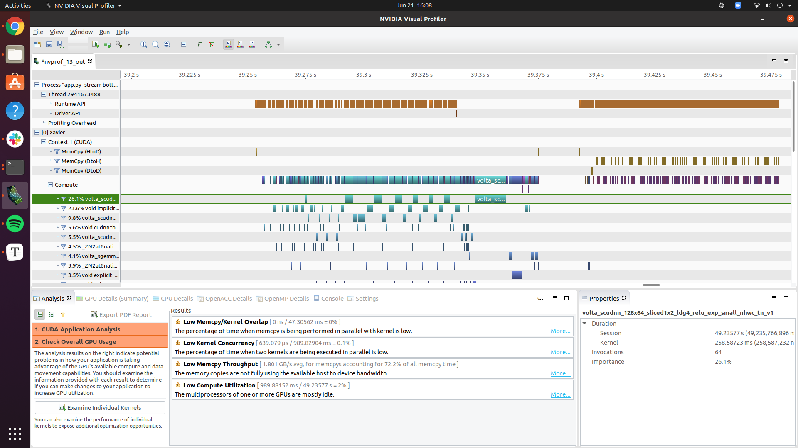
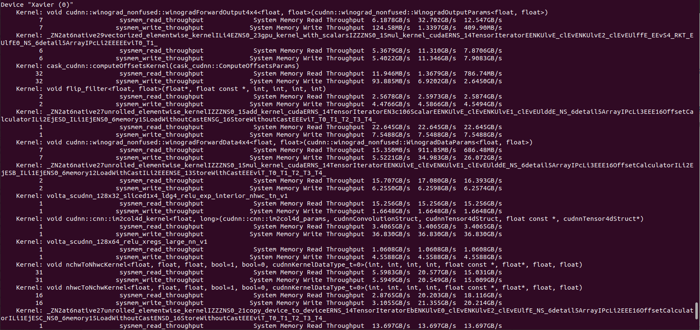

## Tasks Completed

- Presented my research introduction to the group
- Able to download the CUDA tool `nvvp` (Nvidia Visual Profiler) and explore the data points that it collected
  - 
- Here is the output of `nvprof` on the `system_read_throughput` metric:
  -  

## Notes

- Writing a pipeline in bash to execute the docker command to run nvprof and then the object detector. Nvprof attaches to the Python process and then writes a log file that can be inspected with Nvidia Visual Profiler.

  - Currently trying to open the log file with nvvp (the visual profiler)
  - The visual profiler provides some helpful insights into the app's performance like "low memcpy throughput" and "low kernel concurrency" which might help assist researchers to build better apps
  - It also lists a timeline of GPU-Host actions through CUDA

- How does Linux treat memory? (And specifically how does Docker treat memory?) - *virtual memory* is the working memory of processes on Linux. It has a number of advantages being separate from a physical address on RAM: large address spaces, protected process spaces, memory mapping, fair memory allocation, and memory shares.

  - Sources: https://www.golinuxcloud.com/tutorial-linux-memory-management-overview/, 
  - **Inter Process Communication** might be an interesting research topic too
    - It would be a relevant topic to help make resource-limited IoT apps more efficient. For example, it would make sense to share the same libraries among different app containers, especially if all of them do similar tasks. (Although I'm sure Docker already shares the same host libraries among containers) 

- Literature review: https://dl.acm.org/doi/abs/10.1145/2820975.2820980?casa_token=qZXife_dq3sAAAAA%3ACsIpOcrQbZK95dsTU8kZ_k1gRxFpPdVqjXESNVTNxu_RsSmObS5HjX-H4xHndKhjXfMxosHl5wjqyQ, "An Early Resource Characterization of Deep Learning on Wearables, Smartphones and Internet-of-Things Devices"

- Now that I have two tools that can collect the CPU, GPU, and memory usage of the board as it runs, I will start progress on a script that can automate the collection of these data points over time

  - `nvprof` does not support gathering the metric of max GPU memory usage (according to here: https://forums.developer.nvidia.com/t/how-to-get-the-maximum-gpu-memory-usage-with-nvprof/117373)
    - It appears you can track the DRAM throughput of a specific kernel but not the whole process? (Following this presentation on iteratively optimizing a cuda program with nvprof and system analyzer: https://calcul.math.cnrs.fr/attachments/spip/IMG/pdf/CUDA-Optimization-Julien-Demouth.pdf)
    - I will try to track the metric `sysmem_read_throughput`

  

## Meeting notes

- Have we decided on a standard testbed profiling "package" or is that still in the works? If we could decide on a standard profiling package that could be sent to each device (it would include a Docker image, a dataset, and maybe a JSON file listing test commands that show how to run the app) then I could design a pipeline around this standard. The automated pipeline would be able to log useful metrics as the app is run from the test commands.
- It would be helpful to have more apps to profile, because that would help me understand which GPU metrics are the most relevant (if a few stick out among all the apps profiles).
- Should I dive into the code behind the plugins (pywaggle)? If there are ways to make the Python interface to the node more parallelized, then that would appear to be the best solution to optimizing the entire app system. 
