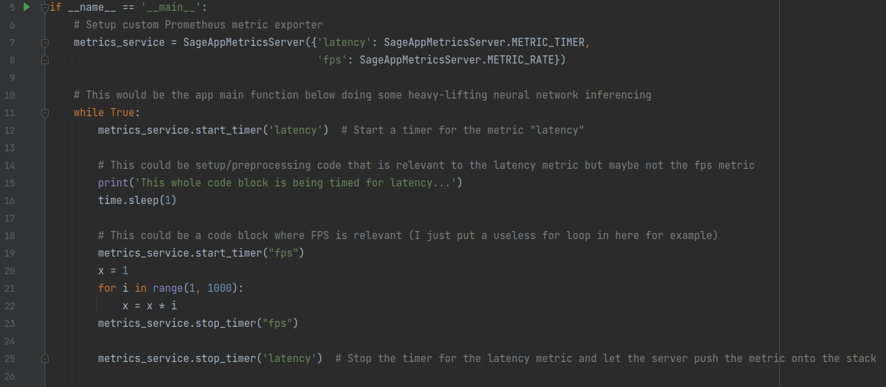
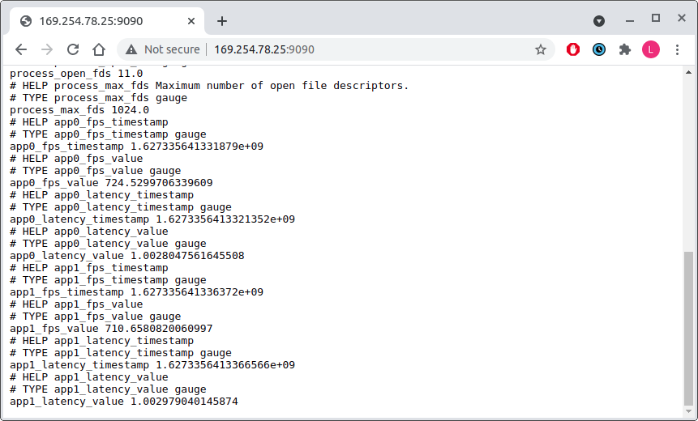

## Notes

- Spent the whole day designing software

## PyWaggle Live Profiling Service

- In the live profiling setup, I see 3 distinct entities:

  - The app 
  - The app metrics client
  - The custom Prometheus client

- The app contains calls to the `live_metrics` Python library which are placed in strategic locations in the app codebase. For example, if a developer wants to time the latency of a function or even a loop within a function, they can place a library call at the beginning of that code block and at the end. They can also specify the time of measurement they want to read, for example `timer` or `rate`. (This is implemented in the `live_metrics` library so developers don't need to compute standard metrics like FPS on their own.)

- Here is an example of an "app" that a developer might write using performance hooks.

  

- At the `stop_timer` call, the `live_metrics` library pushes that measurement onto a metric queue and sends that metric to the custom Prometheus client running as a separate container on the node. The library is able to communicate with the separate Prometheus container through a socket which will be shared with the app image (`/app/live_metrics.sock`). Multiple apps can connect to this socket and send metrics in real time to the Prometheus client.

- The Prometheus client then collects all metrics into a table which is updated every time an app reports an updated metric value. The client hosts an HTTP endpoint at a specific port (I chose 9090) and exposes the most recent metric values to be pulled by the edge controller. Here is the raw output of the HTTP endpoint:

  

## To do

- Coordinate with Aji and Chris to connect Tau, this profiling service, and the edge controller together to form one smooth live metrics pipeline.
- Dockerize the Prometheus client service so that it can collect metrics from any amount of apps that we run.
- Look at potential workshops that we could submit this work to and start on deliverables

