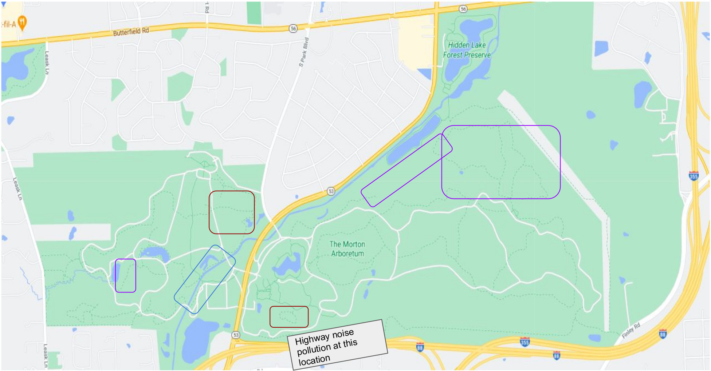

# Morton Arboretum Campaign

## Deployment Site

Currently there is one [BAR-LT](https://github.com/waggle-sensor/summer2021/tree/main/Macintyre/soundrecorder/campaigns/morton-arb#bar-lt) device in Morton Arboretum.  The location of this device is [41.823763, -88.046435](https://goo.gl/maps/CfyDaEhXZEYDkoFR8). The goal is to deploy upto a dozen recording devices in the arb, including 
transects for studying the animal and bird species. 

## Plan

The plan for the Morton Arboretum Campaign consists of 4 parts.
* First, locations need to be selected for inspection.
* Second, the selected locations need to be inspected to determine if a device can be installed there, and if one can be installed, it must be determined if the BAR-LT or the Solar BAR should be used.
* Third, approval for the installation of devices in the selected locations must be received from someone at Morton Arboretum.
* Finally, the devices will be installed in the selected locations to record audio.

If the device's estimation for how long the storage and batteries will last is accurate, then the devices will all need to be inspected approximately every 17 days to charge the batteries and download the audio files off of the SD cards.

## Devices
There is currently one BAR-LT deployed in Morton Arboretum.
6 more BAR-LT devices are available to be deployed, along with 3 Solar BAR devices.
#### BAR-LT

The BAR-LT is a battery-powered device.  Each device has dimensions of 150 x 115 x 70 (mm) and weighs 900 grams if all 6 batteries are inside.
Straps can be used to secure the BAR-LT to trees for recording.  The microphone can be configured to connect to the bottom of the recorder or to the side.
4 SD cards can be used in the device, but right now each device only has one SD card in it.
If the device is set to record 24/7 with 6 fully charged batteries and one 128 GB SD card in it, the batteries will last 29 days and the storage will fill up after 17 days.

#### Solar-BAR
The Solar BAR has a built in solar panel and battery charger to 24/7 recording capabilites over long periods of time.
Each device has dimensions of 250 x 305 x 115 (mm) and weighs 4 kg (including the 12V 7.2Ah battery).
The devices can be mounted on a star picket, but they cannot be fixed to a tree in any way.
If the device is set to record 24/7 with the solar panel positioned to get consistent sunlight with a 128 GB SD card in it, the storage will fill up after 17 days.

#### Images
###### BAR-LT External
[test](https://frontierlabs.com.au/media/catalog/product/cache/78fe0bae2c70c112230b4274eb0a42f4/b/a/bar-lt_-_standard_-_closed_small.jpg)
https://frontierlabs.com.au/media/catalog/product/cache/78fe0bae2c70c112230b4274eb0a42f4/b/a/bar-lt_-_standard_-_closed_small.jpg
###### BAR-LT Internal
https://frontierlabs.com.au/media/catalog/product/cache/78fe0bae2c70c112230b4274eb0a42f4/b/a/bar-lt_new_small.jpg
###### BAR-LT Deployed
https://frontierlabs.com.au/media/catalog/product/cache/78fe0bae2c70c112230b4274eb0a42f4/i/m/img_20190117_172959.jpg
###### SOLAR-BAR External
https://frontierlabs.com.au/media/catalog/product/cache/78fe0bae2c70c112230b4274eb0a42f4/s/o/solar_bar_short.png
###### SOLAR-BAR Internal
https://frontierlabs.com.au/media/catalog/product/cache/78fe0bae2c70c112230b4274eb0a42f4/s/o/solar_bar_open_web_1.jpg
###### SOLAR-BAR Deployed
https://frontierlabs.com.au/media/catalog/product/cache/78fe0bae2c70c112230b4274eb0a42f4/h/a/hamelin_station_reserve_western_australia_deployment_1_1080.jpg

## Locations of Interest

* Red: Migratory birds visit these locations often (i.e warblers) to feed on the evergreen berries.
There are also plenty of recurring cardinal and blue jay sightings at these locations.
* Blue: Best location to spot water fowl is along the river. I’ve recorded sandhill cranes, blue
herons, and white egrets here more often than other water sources on the arb grounds.
* Purple: Most remote / forested location of the arb grounds. Abundance of hawks and
woodpeckers (including a pileated woodpecker nest).

## Final Deployment
